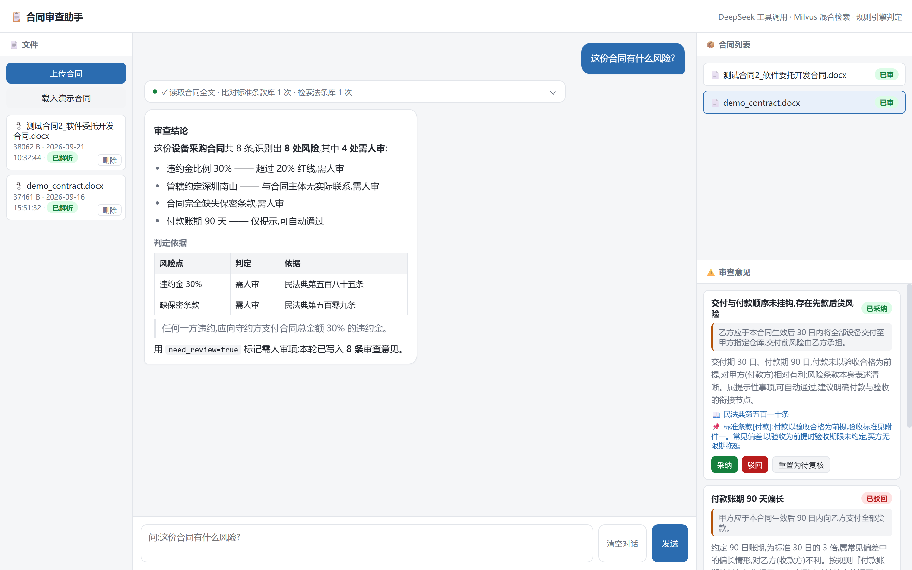

# 合同审查助手（Contract Review Agent）

业务把合同传进来，助手解析全文、逐条比对**标准条款库**、引用**法条依据**，给出「可自动通过 / 需人审」的判定与理由；人工在右侧对每条意见做**采纳 / 驳回**，复核结论落库。

**FastAPI + 本地 Milvus（混合检索）+ 本地 bge-m3（向量化）+ 本地 MinerU（解析）+ DeepSeek 工具调用** —— 除"对话"外全部本地运行。



---

## 功能

| 能力 | 说明 |
|---|---|
| 合同解析入库 | 上传 PDF / DOCX / 图片 → MinerU 解析 → 条款切分 → 落库 |
| 混合检索 | 标准条款库（25 条）+ 法条库（16 条），稠密 + 稀疏双路，RRF 融合排序 |
| 规则引擎先行 | 硬规则（违约金 > 20% / 管辖约定不利 / 缺保密条款）→ 需人审；软规则（账期 > 30 天）→ 仅提示 |
| Agent 工具调用 | 4 个工具 `query_contract` / `search_clause` / `search_law` / `save_finding`，最多 6 轮 |
| 多轮追问 | 带上对话历史 + 已有意见清单，问"第二条的依据是什么"不会重跑整份审查 |
| 人工复核闭环 | 采纳 / 驳回 / 重置 → 写 `findings.review_status`；合同状态由意见推导（待审 / 需人审 / 已审） |

## 技术栈

| 层 | 选型 |
|---|---|
| Web | FastAPI + Uvicorn（SSE 流式） |
| 前端 | 单文件 `index.html`，零依赖（自写 markdown 渲染 + SSE 消费） |
| 大模型 | DeepSeek `deepseek-chat`（工具调用） |
| 向量库 | Milvus Lite（本地文件，无需部署服务） |
| 嵌入 | bge-m3（本地，稠密 1024 维 + 稀疏词权重） |
| 文档解析 | MinerU 3.4.5（PDF / 扫描件 → Markdown） |
| 数据 | SQLite（业务）+ Milvus（条款 / 法条向量） |

## 快速开始

完整步骤见 **[部署说明.md](部署说明.md)**，三步：

```bat
python -m venv .venv
.venv\Scripts\python.exe -m pip install -r requirements.txt      :: ① 依赖
:: ② 模型：models\bge-m3\（2.2 GB）+ models\（MinerU，1.1 GB）
copy .env.example .env                                           :: ③ 填自己的 DEEPSEEK_API_KEY
.venv\Scripts\python.exe -m uvicorn app.main:app --port 8000
```
浏览器打开 http://127.0.0.1:8000/ （首次启动 bge-m3 预热 30~90 秒）

## 项目结构

```
app/
  main.py         FastAPI 入口：接口 + SSE 流式对话 + 文件级联删除
  agent.py        Agent 主循环：工具调用 / 多轮追问 / 规则兜底
  tools.py        4 个工具（save_finding 为替换语义）
  rules.py        人审规则引擎：3 条硬规则 + 1 条软规则
  db.py           SQLite 数据层 + 合同状态推导
  milvus_db.py    Milvus Lite：集合管理、双路检索、断连自动重连
  embed.py        bge-m3 单例（启动预热）
  parse_pdf.py    MinerU 解析 → 条款切分 → 落库
  seed_data.py    标准条款库 25 条 + 法条库 16 条（民法典节选 / 民诉法 / 仲裁法）
  demo.py         演示合同生成
  static/index.html   单文件前端
data/             合同、审查意见、Milvus 向量库、解析产物
docs/             界面截图
部署说明.md        换机器部署指南（含常见问题排查）
requirements.txt  依赖清单（141 包冻结）
.env.example      配置模板（⚠️ 真实 .env 不要提交）
```

## 接口

| 接口 | 作用 |
|---|---|
| `POST /file/upload` | 上传合同 → MinerU 解析 → 入库 |
| `GET /file/list` | 文件列表 |
| `DELETE /file/{id}` | 删除文件（级联删除它的合同与全部审查意见） |
| `GET /contract/list` | 合同列表（状态实时推导） |
| `GET /finding/list` | 审查意见列表 |
| `POST /finding/review` | 人工复核（采纳 / 驳回 / 重置）→ 重算合同状态 |
| `POST /chat` | SSE 流式对话（Agent 工具调用 / 多轮追问） |

## 几个设计取舍

- **规则先行**：`need_review` 由代码规则决定，不让模型自由发挥 —— 同一条款两次审查结论一致，答辩时可解释。
- **规则兜底只在首轮**：模型没写意见时，首轮由规则补录硬规则项；追问句**绝不触发**，否则会把已复核的结论整体覆盖。
- **findings 替换语义**：一次审查 = 一份结论，重新审查覆盖上一批，避免重复堆积。
- **合同状态只由意见推导**：读取时实时计算（待审 / 需人审 / 已审），不存在"处理完了状态还不变"的过期数据。
- **本地优先**：解析、检索、向量化全部本机完成，只有"对话"需要联网。

## 已知局限

- 多轮上下文只带纯文本问答 + 已有意见清单（存浏览器 localStorage，未做服务端会话表）。
- 重新审查会覆盖该合同此前的复核结论。
- 两个模型目录共 3.3 GB，不随仓库分发（见 [部署说明.md](部署说明.md)）。
